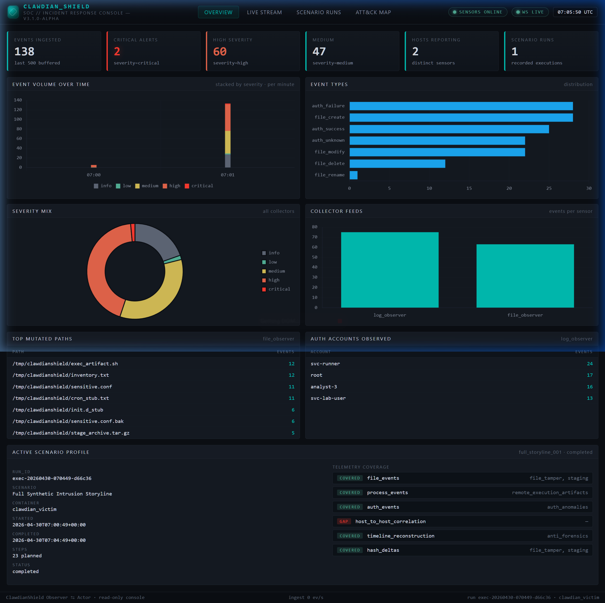
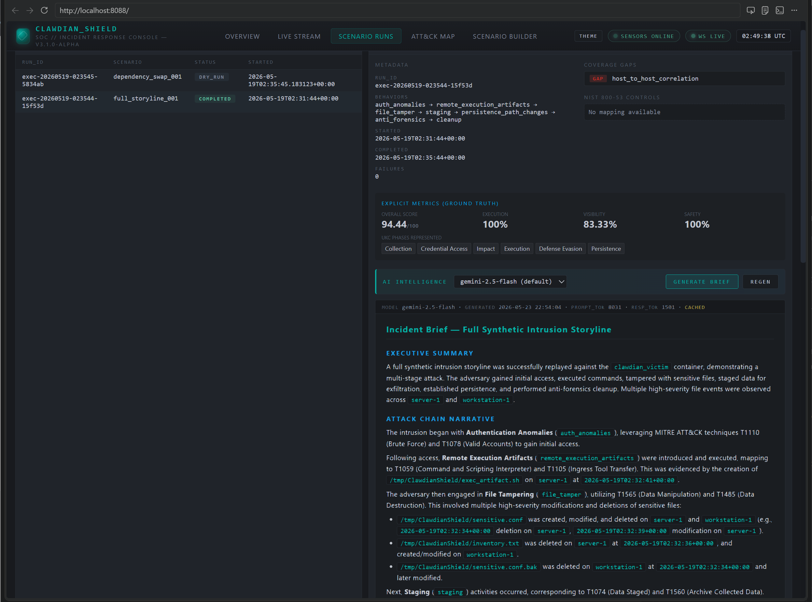
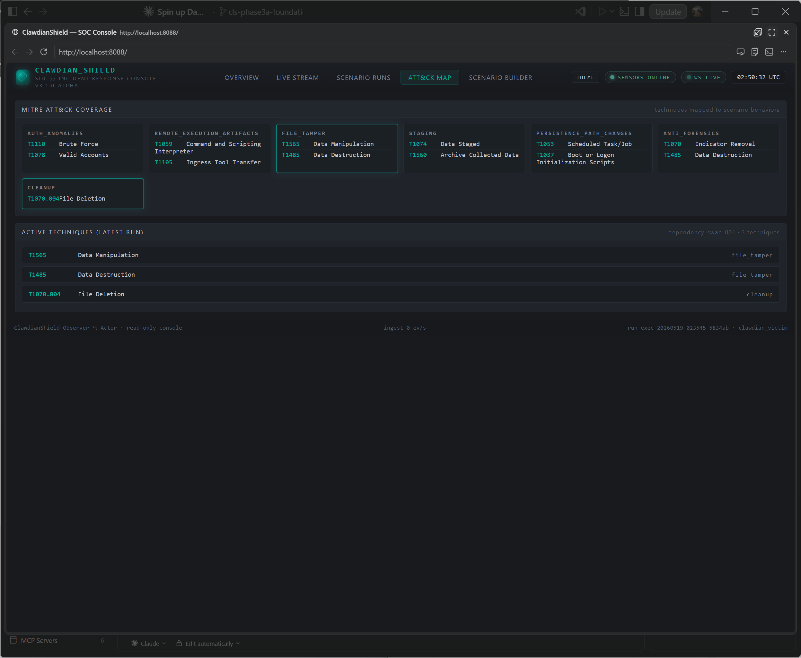
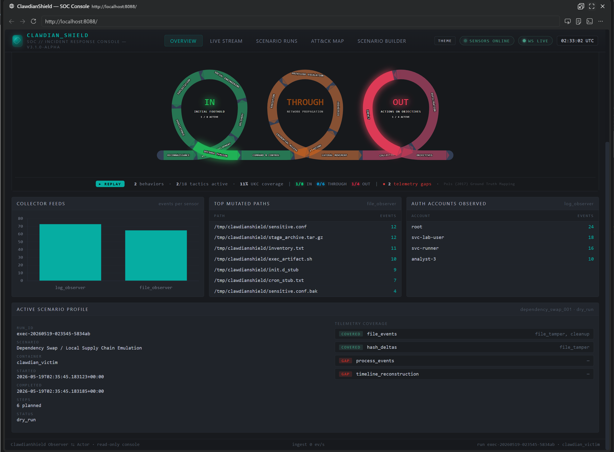
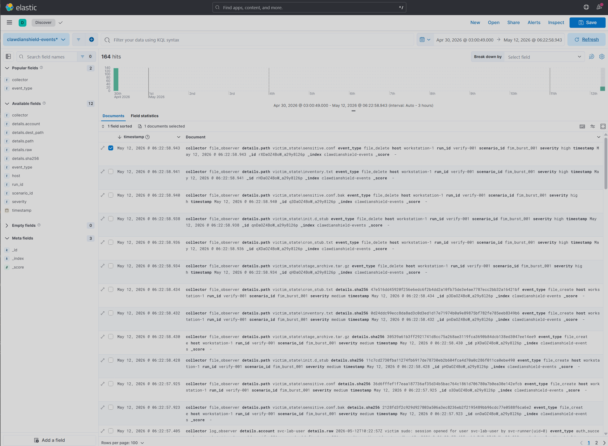

# ClawdianShield

> Your company just deployed an AI-native SOC platform. It cost six figures. It promises autonomous detection, triage, and response. But here is the question nobody is asking: **how do you know it actually works?**
>
> You can run vendor-supplied test scenarios, but those were written by the same team that built the model. You can review the dashboards, but dashboards only show what the system *chose* to surface. For all practical purposes, your organization now trusts its survival to a black box that **grades its own homework.**
>
> **ClawdianShield exists to solve that problem.** It generates deterministic, real-world adversary telemetry and measures whether your detection stack — AI-native or otherwise — actually caught it. No vendor bias. No synthetic hallucination. Just ground-truth signal and a brutal coverage score.

**A detection engineering platform and adversary emulation pipeline.** A working, deterministic, zero-outbound digital crime scene engineered to produce the exact telemetry your SOC is almost certainly missing right now.

> [!IMPORTANT]
> **Status: Phase 3a foundation is live.**
> Elastic/Kibana ingest, the local SOC dashboard, Gemini briefs, and Stack Monitoring via Metricbeat are working in the lab. Splunk HEC wiring and credential-backed publishing flows remain backlog or environment-dependent.

---

**Proof of Execution — Authentic Host Telemetry**

When `fim_burst_tamper.json` fires, the execution plane induces real state changes, and the host-side observer instantly streams the evidence:

```json
{
  "run_id": "live-fire-001",
  "scenario_id": "fim_burst_001",
  "host": "workstation-1",
  "event_type": "file_create",
  "timestamp": "2026-04-29T01:01:52.906Z",
  "severity": "medium",
  "details": {
    "path": "victim_state/sensitive.conf",
    "sha256": "b7bce5de2b533fd8ad8ea39be699ae4b39bbaaada16e2dd029848c745d0ab816"
  },
  "collector": "file_observer"
}
```



---

## The Problem (In Plain English)

Most security portfolios are a stack of certs and CTF writeups. ClawdianShield is different — it solves a specific, expensive, embarrassing business problem: **you don't actually know if your detections work until a breach proves they don't.**

- **Startups** can't afford a $50K red team engagement just to confirm their open-source logging fires.
- **Enterprise SOCs** have millions in SIEM licenses and exactly zero confidence their rules catch a real intrusion chain.
- **AI-native platforms** are the worst offenders — they surface what their model *thinks* matters and bury everything else.

This system is a **black-box adversary emulation engine** that induces real defender-relevant artifacts, measures whether your stack caught them, and scores your blind spots without remorse.

The scenarios don't ship real exploits or credential attack logic. They produce the *signals* defenders care about — auth anomalies, file tampering chains, cross-host traces, staging activity, persistence-path writes, anti-forensics pressure — without depending on target internals or crossing into operationally abusive territory. The point is detection coverage and telemetry quality, not malware cosplay.

---

## Architecture — The Four Planes

```text
Control Plane    — Load scenario JSON → validate safety constraints → build attack plan
Execution Plane  — Translate behaviors → docker exec commands → fire at victim
Telemetry Plane  — Host-side observers stream JSONL evidence from bind-mounted state
Evaluation Plane — Score expected vs. observed, generate JSON report with blind spots
```

**The key design decision:** observers run on the *host* (not inside the victim) watching bind-mounted directories. Real artifacts. Real reads. Zero in-process telemetry fabrication. You can't fake your way past it.

```text
scenarios/<id>.json
        │
        ▼
core/runner/executor.py               ← subprocess engine, safety gate, behavior→cmd map
  docker exec clawdian_victim sh -c "<cmd>"
        │                                        ┌──────────────────────────────────┐
        │  artifacts (real)                      │  core/observers/file_observer   │
        ▼                                        │  core/observers/log_observer    │
  clawdian_victim:/tmp/ClawdianShield --bind-->  │  (host-side watchdog + tail;    │
  clawdian_victim:/var/log             mount     │   emit JSONL via NormalizedEvent)│
                                                 └──────────────┬───────────────────┘
        │                                                       ▼
        ▼                                           evidence/file_events.jsonl
reports/<run_id>_exec_log.json                      evidence/auth_events.jsonl
```

Full diagram: [`docs/architecture.puml`](docs/architecture.puml)

---

## The Menu of Mayhem — Scenario Catalog

The core hand-authored crime scenes. All JSON. All deterministic. All embarrassing for your detection stack.

| ID | Name | Risk | Hosts |
| :--- | :--- | :--- | :--- |
| `fim_burst_001` | FIM Burst Tamper Storm | Medium | 1 |
| `trusted_binary_blend_001` | Trusted Binary Tamper Blend | Medium | 1 |
| `sensitive_config_drift_001` | Sensitive Config Drift | Medium | 1 |
| `auth_abuse_001` | Synthetic Multi-Host Auth Abuse | High | 2 |
| `remote_exec_artifacts_001` | Remote Execution Artifact Chain | High | 2 |
| `collection_staging_001` | Collection and Staging Run | High | 1 |
| `persistence_path_mutation_001` | Persistence Path Mutation | Critical | 1 |
| `anti_forensics_pressure_001` | Anti-Forensics Pressure Test | Critical | 1 |
| `dependency_swap_001` | Dependency Swap / Supply Chain Emulation | Critical | 1 |
| `full_storyline_001` | Full Synthetic Intrusion Storyline | High | 2 |

The full storyline chains auth burst → remote execution artifacts → enumeration/staging → persistence-path mutation → anti-forensics → cleanup. One run, seven stages, one scorecard.



---

## Atomic Red Team Import

`core/runner/atomic_converter.py` converts a cloned Atomic Red Team `atomics/`
tree into ClawdianShield scenario JSON under `scenarios/atomic/`. Linux shell
tests become runnable scenarios; non-Linux, non-shell, elevated, or dependency-
gated tests are still surfaced, but emitted inert so they can be reviewed
without being executed accidentally.

```bash
# Convert one technique file to stdout
python core/runner/atomic_converter.py \
  --file vendor/atomic-red-team/atomics/T1070.004/T1070.004.yaml \
  --stdout

# Convert a full atomics/ tree into scenario JSON
python core/runner/atomic_converter.py \
  --atomics-dir vendor/atomic-red-team/atomics \
  --out scenarios/atomic
```

---

## The Scorecard

Every run is graded across five dimensions. If your stack is blind, this tells you exactly where — and by how much.

| Dimension | Weight | Question It Answers |
| :--- | :---: | :--- |
| Detection Coverage | 30% | Did the expected detections actually fire? |
| Telemetry Completeness | 25% | Were all required event classes observed? |
| Correlation Quality | 20% | Were cross-host and cross-stage events linked? |
| Timeliness | 15% | Was activity surfaced before the attacker cleaned up? |
| Analyst Usefulness | 10% | Does the alert tell a coherent story? |



---

## SOC / IR Dashboard

A Kibana-styled analyst console that reads the same JSONL evidence in real time. Severity timeseries, MITRE ATT&CK technique coverage mapped to the **Unified Kill Chain (Pols, 2017)** 18-tactic taxonomy, top mutated paths, scenario step traces, and a live WebSocket-backed event stream.

The Kill Chain visualization renders three phases — **IN** (Initial Foothold), **THROUGH** (Network Propagation), **OUT** (Actions on Objectives) — as glowing donut rings. Active tactic arcs light up as telemetry fires. If the whole ring is dim, your SOC has a problem.

**Visual Playback:** The dashboard includes an animated, slow-motion playback feature for the Unified Kill Chain visualizer. Analysts can watch a cinematic, step-by-step trace of attack scenarios traversing the kill chain loops in real-time, illuminated by a rollercoaster-style glowing tracer.



```bash
# Start the console
python platform/dashboard/server.py --host 0.0.0.0 --port 8088
# → http://localhost:8088
```

Use the file path form here because the repo's top-level `platform/` package
collides with Python's stdlib `platform` module.

Endpoints:

| Route | Method | Description |
| :--- | :--- | :--- |
| `/` | GET | Analyst console (SPA) |
| `/api/stats` | GET | Aggregated metrics over buffered evidence |
| `/api/runs` | GET | All exec_log run summaries |
| `/api/events?limit=N` | GET | Last-N buffered NormalizedEvents |
| `/api/attack-map` | GET | MITRE ATT&CK technique mapping per behavior |
| `/api/brief/<run_id>` | GET | Gemini AI incident brief for a completed run |
| `/ws` | WebSocket | Live event push — snapshot on connect, then per-event frames |

The server is read-only. It never mutates evidence or fires scenarios. It just tells you what happened.

---

## AI Intelligence Plane

Every completed run can generate a **Gemini-powered analyst brief** — executive summary, attack chain narrative, telemetry gap assessment, detection recommendations, and a risk rating. Think of it as the analyst who actually read all 138 events so you don't have to.

Powered by `google-genai` SDK. Default model: `gemini-2.5-flash`. Model is selectable in the UI — swap to Pro if you want it to sound more alarmed.

```bash
# Set your key in .env
GEMINI_API_KEY=your_key_here

# Brief generates automatically from the dashboard after any scenario run
# or hit the endpoint directly:
GET /api/brief/<run_id>?model=gemini-2.5-flash
```

---

## SIEM Forwarding — Elastic + Monitoring (Phase 3a)

`platform/telemetry/forwarders/elastic_shipper.py` bulk-ingests the evidence
JSONL stream into Elasticsearch so the same ground-truth telemetry the dashboard
scores can be queried, pivoted, and alerted on from a real SIEM — not just the
built-in console.

For a fully populated lab, `scripts/seed_all_scenarios.py` walks every
`scenarios/single-host/*.json`, writes fresh `evidence/*.jsonl`, emits one
`reports/<run_id>_exec_log.json` per scenario, and then forwards the combined
batch into Elasticsearch.

Bring up the single-node Elastic stack and monitoring sidecar with:

```bash
docker compose --env-file .env -f docker/docker-compose.yml up -d \
  elasticsearch kibana metricbeat
```

If `ELASTICSEARCH_URL=http://localhost:9200` is configured, seed and ship with:

```bash
python scripts/seed_all_scenarios.py
```

Events land with their full NormalizedEvent shape — `collector`, `event_type`,
`details.path`, `host`, `run_id`, `scenario_id`, `severity`, `timestamp` — so
each scenario run is fully reconstructable in Kibana Discover. The added
`metricbeat` service also feeds `.monitoring-es-*` and `.monitoring-kibana-*`
for Kibana Stack Monitoring.



---

## Running It

```bash
# 1. Spin up the victim container
docker compose --env-file .env -f docker/docker-compose.yml up -d clawdian_victim

# 2. Start the file observer (Terminal 1)
python core/observers/file_observer.py \
  --watch victim_state \
  --output evidence/file_events.jsonl \
  --run-id verify-001 \
  --scenario-id fim_burst_001 \
  --host workstation-1

# 3. Start the auth log observer (Terminal 2)
python core/observers/log_observer.py \
  --watch victim_logs/auth.log \
  --output evidence/auth_events.jsonl \
  --run-id verify-001 \
  --scenario-id fim_burst_001 \
  --host workstation-1

# 4. Fire the scenario (Terminal 3)
python core/runner/executor.py \
  scenarios/single-host/fim_burst_tamper.json \
  --container clawdian_victim \
  --reports reports

# 5. Launch the dashboard (Terminal 4)
python platform/dashboard/server.py --host 0.0.0.0 --port 8088

# Dry-run any scenario without Docker (validates parsing + safety gate)
python core/runner/executor.py scenarios/single-host/fim_burst_tamper.json --dry-run --reports reports
```

Two output streams land per run:
- `reports/<run_id>_exec_log.json` — per-step trace, telemetry coverage, gap analysis
- `evidence/{file_events,auth_events}.jsonl` — host-side `NormalizedEvent` JSONL

---

## Local Setup

```bash
# 1. Clone
git clone https://github.com/dadopsmateomaddox/ClawdianShield.git
cd ClawdianShield

# 2. Python deps
pip install -r requirements.txt

# 3. Node deps (Linear tooling only — skip if you don't care about issue tracking)
npm install

# 4. Configure secrets — never commit real values
cp .env.example .env
# GEMINI_API_KEY — for AI briefs
# ELASTICSEARCH_URL=http://localhost:9200 — for Elastic seeding/shipping
# LINEAR_API_KEY — for issue tracking (optional)

# 5. Seed Linear backlog (idempotent)
npm run bootstrap-linear
```

**Environment:** Docker Desktop 4.70+ with WSL2 backend. Python 3.11+.

---

## Repo Structure

```text
ClawdianShield/
├── core/
│   ├── runner/          executor.py, atomic_converter.py
│   ├── observers/       file_observer.py, log_observer.py, run.py
│   ├── intelligence/    gemini_client.py, confluence_publisher.py
│   ├── evaluation/      scoring and telemetry gap analysis
│   └── models/          NormalizedEvent / RunContext schema
├── platform/
│   ├── dashboard/       server.py, seed_demo.py, static/ SPA assets
│   └── telemetry/       elastic_shipper.py, splunk_hec.py, collectors/
├── scenarios/
│   ├── single-host/     hand-authored scenario JSON
│   └── atomic/          imported Atomic Red Team scenario JSON
├── vendor/              local Atomic Red Team checkout used for conversion
├── docker/              docker-compose.yml, Metricbeat config, images
├── evidence/            JSONL event output (gitignored)
├── reports/             exec logs, scores, AI briefs (gitignored)
├── docs/                PlantUML diagrams + README screenshots
├── tests/               validation harness
├── scripts/             seed_all_scenarios.py and support tooling
└── utils/               JSONL helpers
```

---

## Telemetry Schema

All observers emit JSONL to `evidence/` using the `NormalizedEvent` schema (`core/models/event_schema.py`, Pydantic v2):

```json
{
  "run_id": "exec-20260426-085200-d32503",
  "scenario_id": "fim_burst_001",
  "host": "workstation-1",
  "event_type": "file_create",
  "timestamp": "2026-04-26T08:52:00.587542+00:00",
  "severity": "medium",
  "details": { "path": "victim_state/sensitive.conf", "sha256": "36d6f..." },
  "collector": "file_observer"
}
```

| Module | What It Does | Status |
| :--- | :--- | :--- |
| `core/observers/file_observer.py` | Watchdog PollingObserver on bind-mounted victim state | live |
| `core/observers/log_observer.py` | Log tailer; regex-classifies pam_unix auth events | live |
| `core/observers/run.py` | Convenience launcher — starts both observers, shared stop event | live |
| `core/observers/correlation.py` | Cross-host adjacency from `details.source_host` | utility |
| `core/observers/normalizer.py` | Dict → NormalizedEvent boundary validator | utility |
| `core/observers/file_events.py` | sha256 snapshot/diff helpers | utility |

---

## Phase Status

| Phase | Description | Status |
| :--- | :--- | :--- |
| 1 — Core Engine | Scenario executor, Docker victim, safety gate, dry-run mode | ✅ Complete |
| 2 — SOC Dashboard | FastAPI + WebSocket console, UKC visual playback, ATT&CK map | ✅ Complete |
| 2b — AI Intelligence | Gemini brief generation, google-genai SDK, model selector | ✅ Complete |
| 3a — Telemetry | Elastic + Kibana + Metricbeat monitoring (`platform/telemetry/`) | ✅ Working |
| 3b — Splunk | Splunk HEC forwarder and container wiring | 📋 Backlog |
| 3c — Reporting | Confluence publishing and credential-backed workflows | 🚧 In progress |
| 4 — Scenario Expansion | Atomic imports plus additional lab-safe scenarios | 🚧 In progress |

---

## How It's Built — RE Claw Code

I follow a workflow called **RE Claw Code**: reverse engineering discipline and incident response paranoia applied to software development.

- **Tracking:** Every component maps to a **Linear** issue (`ClawCode_V-ClaudeCode` team)
- **Git Flow:** Branch naming `cls-<id>/<description>`, commits reference issue IDs
- **AI Pair Programming:** Claude Code CLI for implementation. I dictate the physics of the universe; it builds the furniture. Gemini for architecture review. They disagree sometimes. I referee.

The backlog was seeded programmatically via `scripts/linear-bootstrap.js`. GitHub ↔ Linear sync via `.github/workflows/linear-sync.yml` — merged PRs close Linear issues automatically.

---

## Security Notes

- `.env` is gitignored and cursorignored — never committed
- `.env.example` contains only placeholders — safe to commit
- All secrets loaded via `dotenv` at runtime
- Rotate any key that has appeared in a terminal, chat, or log file. Yes, that one too.

---

## Contact

Actively seeking feedback from **Detection Engineers, DFIR professionals, and Cloud Architects** who want to break it.

- **GitHub:** Open an issue — request a specific emulation chain, report a gap, or challenge the scorecard weights
- **LinkedIn:** [Kevin Landry](https://www.linkedin.com/in/kevin-landry-cybersecurity)
