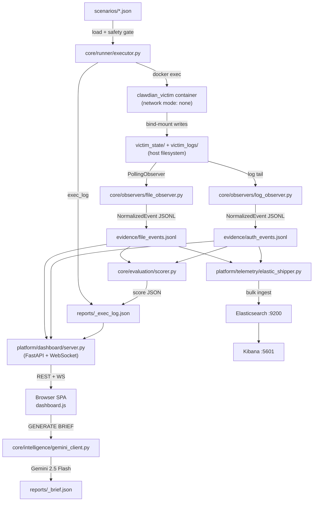
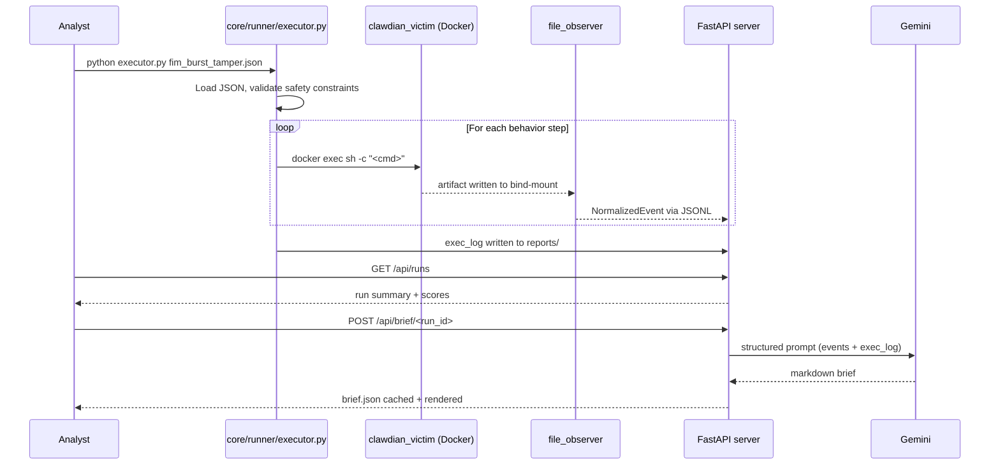

# System Architecture

ClawdianShield is organized around **four planes**, each with a distinct responsibility:

```
Control Plane    — Load scenario JSON → validate safety constraints → build attack plan
Execution Plane  — Translate behaviors → docker exec commands → fire at victim container
Telemetry Plane  — Host-side observers stream JSONL evidence from bind-mounted state
Evaluation Plane — Score expected vs. observed, generate JSON report with blind spots
```

The key design decision: **observers run on the host, not inside the victim.**
They watch bind-mounted directories (`victim_state/`, `victim_logs/`) and emit real
`NormalizedEvent` JSONL — zero in-process telemetry fabrication.

---

## Component Map

```
ClawdianShield/
├── core/
│   ├── runner/          executor.py — scenario loader, safety gate, behavior→cmd map
│   │                    atomic_converter.py — ART YAML → scenario JSON
│   ├── observers/       file_observer.py — PollingObserver on bind-mounted victim_state/
│   │                    log_observer.py  — log tailer, regex auth-event classifier
│   │                    run.py           — launcher (starts both observers, shared stop)
│   │                    correlation.py   — cross-host adjacency via details.source_host
│   │                    normalizer.py    — dict → NormalizedEvent boundary validator
│   ├── evaluation/      scorer.py — five-dimension detection scoring
│   ├── intelligence/    gemini_client.py — Gemini 2.5 Flash brief generation
│   │                    confluence_publisher.py — HTML report → Confluence REST
│   └── models/          event_schema.py — NormalizedEvent + RunContext (Pydantic v2)
│
├── platform/
│   ├── dashboard/       server.py     — FastAPI, WebSocket push, REST API
│   │                    seed_demo.py  — offline demo data population
│   │                    static/       — SPA (dashboard.js, index.html, style.css)
│   └── telemetry/       elastic_shipper.py — JSONL → Elasticsearch bulk ingest
│                        splunk_hec.py      — Splunk HEC forwarder (Phase 3b, backlog)
│
├── scenarios/
│   ├── single-host/     10 hand-authored scenario JSON files
│   └── atomic/          Atomic Red Team imports (generated by atomic_converter.py)
│
├── docker/              docker-compose.yml — victim + Elastic + Kibana + Metricbeat
├── vendor/              local Atomic Red Team atomics/ checkout
├── scripts/             seed_all_scenarios.py and support tooling
├── tests/               validation harness
├── evidence/            JSONL event streams (gitignored)
└── reports/             exec logs, scores, AI briefs (gitignored)
```

---

## Data-Flow Diagram



---

## Sequence: Scenario Execution to Dashboard



---

## API Reference

The dashboard server (`platform/dashboard/server.py`) exposes a read-only API.
It **never** mutates evidence or triggers scenario execution.

| Route | Method | Description |
|:------|:------:|:------------|
| `/` | GET | Analyst console SPA |
| `/api/stats` | GET | Aggregated metrics over buffered evidence |
| `/api/runs` | GET | All exec_log run summaries |
| `/api/events?limit=N` | GET | Last-N buffered NormalizedEvents |
| `/api/attack-map` | GET | MITRE ATT&CK technique mapping per behavior |
| `/api/brief/<run_id>` | GET | Gemini AI incident brief for a completed run |
| `/ws` | WS | Live event push — snapshot on connect, then per-event frames |

---

## Scoring Model

Every run is graded across five dimensions. Scores are written to `reports/<run_id>_exec_log.json`.

| Dimension | Weight | Question |
|:----------|:------:|:---------|
| Detection Coverage | 30% | Did expected detections fire? |
| Telemetry Completeness | 25% | Were all required event classes observed? |
| Correlation Quality | 20% | Were cross-host and cross-stage events linked? |
| Timeliness | 15% | Was activity surfaced before cleanup? |
| Analyst Usefulness | 10% | Does the alert tell a coherent story? |

---

## Phase Status

| Phase | Description | Status |
|:------|:------------|:------:|
| 1 — Core Engine | Scenario executor, Docker victim, safety gate, dry-run | ✅ Complete |
| 2 — SOC Dashboard | FastAPI + WebSocket, UKC visualization, ATT&CK map | ✅ Complete |
| 2b — AI Intelligence | Gemini brief generation, model selector, cached reports | ✅ Complete |
| 3a — Elastic Telemetry | Elastic + Kibana + Metricbeat monitoring | ✅ Live-verified |
| 3b — Splunk | Splunk HEC forwarder and container wiring | ⏳ Backlog |
| 3c — Reporting | Confluence publishing and credential-backed workflows | 🚧 In progress |
| 4 — Scenario Expansion | Atomic imports + additional lab-safe scenarios | 🚧 In progress |

See [`docs/PHASE3_STATUS.md`](PHASE3_STATUS.md) for current Phase 3 blockers and next steps.

