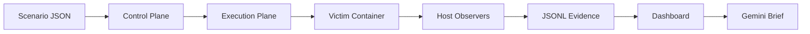

# System Architecture

## High-Level Overview

```mermaid
graph LR
  A["Scenario JSON"] --> B["Control Plane"]
  B --> C["Execution Plane"]
  C --> D["Victim Container"]
  D --> E["Host Observers"]
  E --> F["JSONL Evidence"]
  F --> G["Dashboard"]
  G --> H["Gemini Brief"]
```
